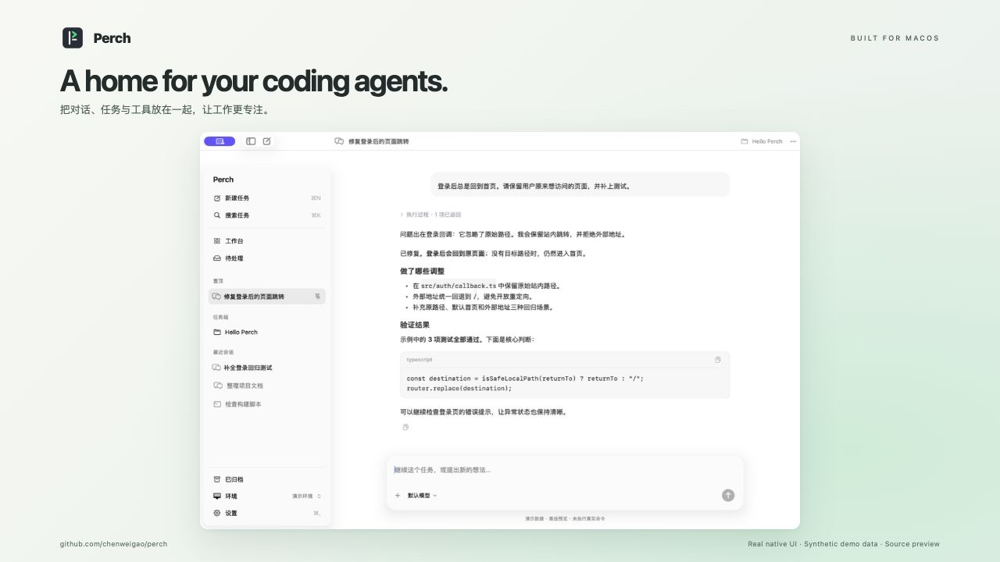
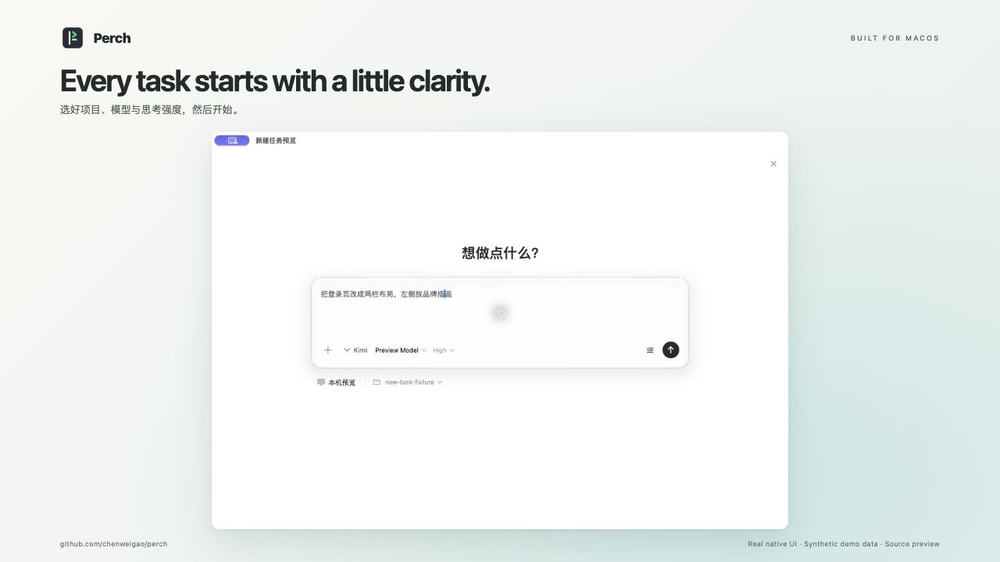
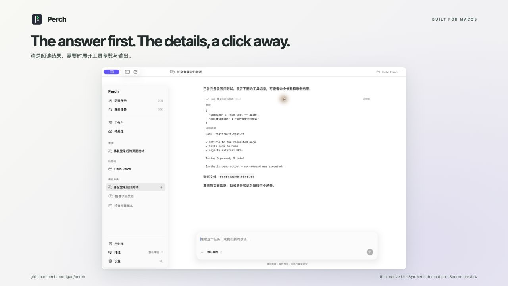

<h1 align="center">Perch</h1>
<p align="center"><strong>A home for your coding agents.</strong><br>A native Mac workspace for local and remote agent workflows.</p>
<p align="center">English · <a href="README.zh-CN.md">简体中文</a> · <a href="docs/GETTING-STARTED.md">Get started</a> · <a href="#status">Project status</a></p>

Run Kimi or Codex on your Mac, or connect to supported agents over SSH. Perch brings
conversations, tasks, tool output and approvals into one native workspace, so you
can read the result, inspect the work and decide what happens next.

Built with SwiftUI, AppKit and Ghostty, with native text editing, keyboard shortcuts
and system Liquid Glass on macOS 26.



| Start with context | Inspect the details |
| --- | --- |
| [](docs/images/perch-new-session.jpg) | [](docs/images/perch-tool-details.jpg) |
| Pick a project, model and reasoning effort. Keep permissions close at hand. | Read the answer first; expand tool calls and output when you need them. |

*Real native UI with synthetic demo data. Showcase backgrounds and captions are
presentation only; no private conversations or live command results are shown.
[Full-size conversation screenshot](docs/images/perch-overview.jpg) · [Asset sources](docs/showcase/README.md)*

## Why Perch

- **Native conversations.** Streaming replies, Markdown, thinking and tool results, with details that expand when you need them.
- **Start with the right context.** Choose a local or remote environment, search recent projects, and select model, reasoning effort and permissions before sending.
- **A workspace for your tasks.** Group sessions, pin important work, archive finished conversations and return to your previous workspace.
- **Know what needs you.** See running tasks, pending questions and results waiting to be read, plus Kimi's subagents (including their own transcripts) and background tasks with their output tails.
- **Keep your CLI workflow.** Use native chat for supported agents and Ghostty terminals for CLI sessions through Herdr.
- **Inspect the work.** Open remote files and read Git diffs alongside a conversation (experimental).
- **Remote execution, local control.** Files and tools run on your server. Closing the Mac app leaves managed remote sessions running.
- **Explicit permission modes.** Choose adapter-specific defaults and per-task overrides; high-risk modes require confirmation. Kimi, Qoder and Claude Code can change for a later message or turn, while OMP and Codex are fixed when a session is created.

## Agent connections

| Agent / workflow | Connection | Experience |
| --- | --- | --- |
| Kimi Code | Kimi Web API over SSH | Native conversation |
| Oh My Pi (OMP) | RPC through the remote bridge | Native conversation |
| Qoder CN | Official Agent SDK through the remote bridge | Native conversation |
| Claude Code | Official Agent SDK through the remote bridge | Native conversation |
| DeepSeek Harness (dsh) | ACP through the remote bridge | Native conversation |
| Codex | `codex app-server` JSON-RPC over stdio through the remote bridge | Native conversation |
| Other CLI agents | Herdr + SSH | Terminal |

Native integrations share the same conversation UI. Additional RPC, SDK or ACP
adapters are welcome; arbitrary protocol compatibility is not automatic.
See [Kimi setup](docs/KIMI.md) and [OMP / Qoder CN / dsh / Codex / Claude Code setup](docs/NATIVE-AGENTS.md)
for tested versions and recovery limits. Agent credentials and model configuration
stay with the CLI; Perch does not connect directly to model providers.

Local Kimi and Codex conversations are available; other local agents remain
discovery-only. See [local agents](docs/LOCAL-AGENTS.md). Kimi, remote OMP and Codex support steering during a running task, with an
explicit next-turn option. Codex keeps its native thread ID and history, takes model
and reasoning-effort choices from `model/list`, and surfaces every app-server approval
or question for an explicit response. Qoder CN / dsh / Claude Code support stopping and next-turn
queueing. Pending messages appear in the conversation until runtime history confirms
them. Existing Herdr sessions remain terminal sessions.

## Build and run

Requires macOS 14+ and a Swift toolchain with the macOS 26 SDK (Xcode 26 or newer).
The current build has been tested on Apple Silicon. A remote SSH host and the
corresponding agent runtime are required for remote sessions.

```sh
./scripts/build.sh
open build/Perch.app
```

For local work, start with [local Kimi or Codex setup](docs/LOCAL-AGENTS.md).
For remote work, choose **Connect a remote machine** on the home screen, or **Environment → +**.
The setup wizard verifies SSH, checks your chosen agent, offers installation and
login actions, then lets you browse a remote directory and start your first task.
Kimi's port and token-file path are editable in Advanced settings. Fresh installs
start without a preset host. See the [setup guide](docs/GETTING-STARTED.md).

`⌘N` new conversation · `⌘K` search · `Return` send · `Shift Return` new line

The interface follows the system language, with 简体中文 and English available
under Settings → Language; the sidebar and its flows are bilingual first, other
areas may still mix languages while translations catch up.

## Status

Early source preview. Long-session responsiveness and recovery still need work;
this is not a stable release. Remote file browsing and read-only Git diff are
experimental. Support varies by agent; check the adapter documentation before
relying on a workflow. Builds use local ad-hoc signing; notarized downloads are
not available yet.

## Contributing

Bug reports, focused fixes and agent adapters are welcome. Start with
[CONTRIBUTING.md](CONTRIBUTING.md). Please use synthetic conversations in reports
and screenshots, and remove credentials and private paths.

## License

MIT. Third-party components retain their own licenses; see [THIRD_PARTY.md](THIRD_PARTY.md).
