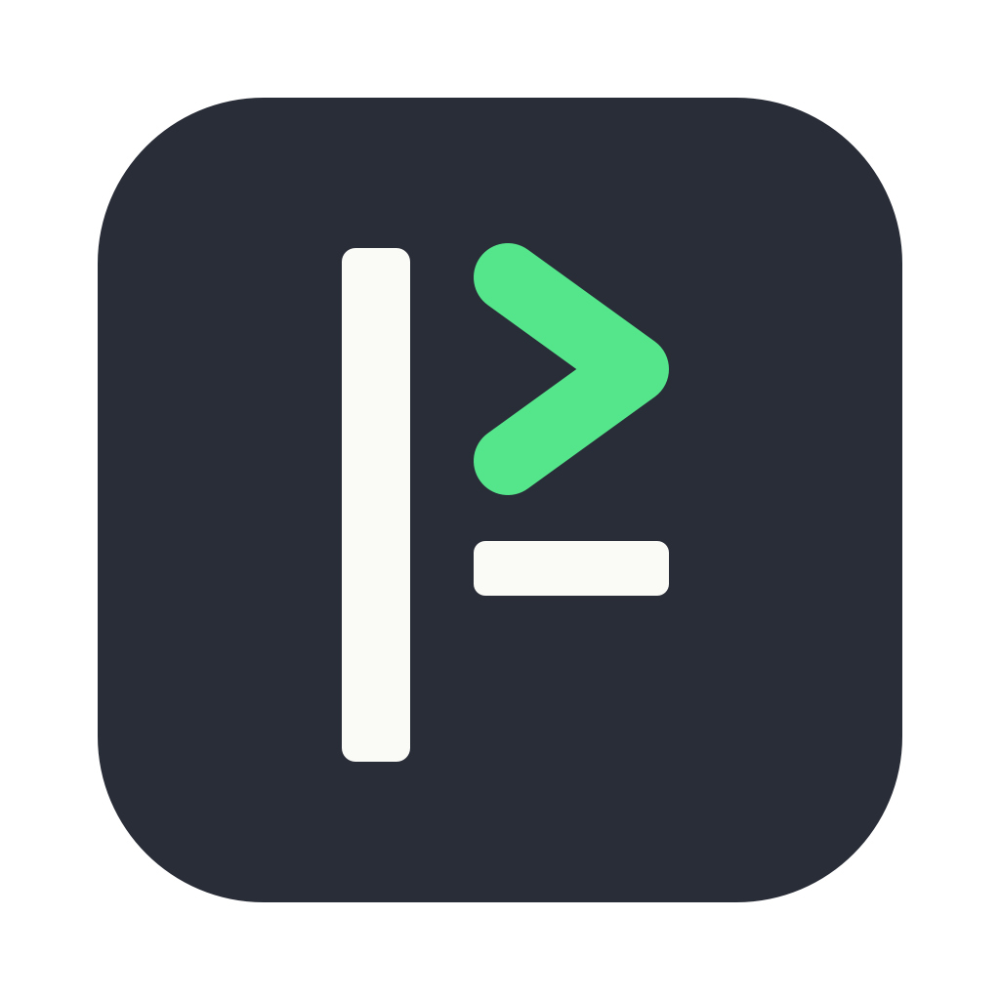
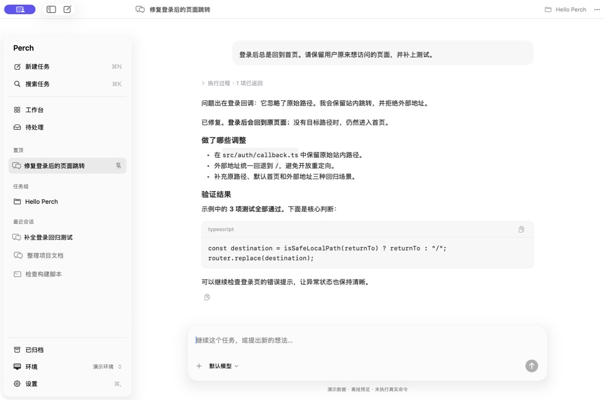
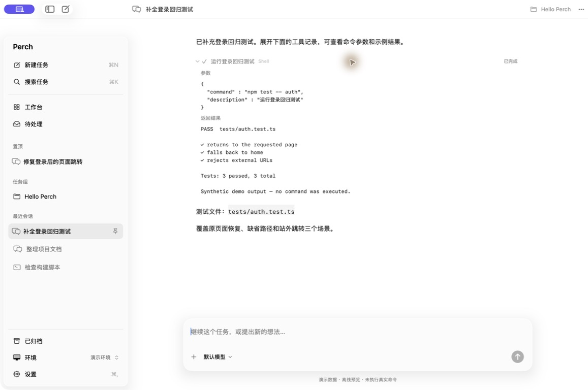

<p align="center"></p>
<h1 align="center">Perch</h1>
<p align="center"><strong>为 coding agent 打造的 Mac 原生工作台。</strong><br>Agent 在远端工作，你在 Mac 上掌握进展。</p>
<p align="center"><a href="README.md">English</a> · 简体中文</p>

把对话、工具、审批与任务管理放进一个 macOS App。
代码和 Agent 留在远端，通过 SSH 连接；在 Mac 上阅读回复、处理提问、继续工作。

使用 SwiftUI、AppKit 和 Ghostty 构建，支持原生文本、快捷键，以及 macOS 26
的 Liquid Glass 控件。围绕简洁、流畅的阅读与操作体验设计。



*使用真实 macOS 组件与演示数据；图中没有执行真实命令。*

<details>
<summary>工具详情（演示数据）</summary>



</details>

## 为什么用 Perch

- **原生对话**：流式回复、Markdown、思考和工具结果，需要时再展开详情。
- **任务工作台**：会话归组、置顶、归档，重新打开后回到工作现场。
- **集中处理**：看到哪些任务在运行、哪些在等你、哪些结果还没读。
- **保留 CLI 工作流**：已适配的 Agent 使用原生对话，其他 CLI 通过 Herdr 使用 Ghostty 终端。
- **查看工作内容**：在对话旁查看远程文件与只读 Git diff（实验性）。
- **远端执行，本地掌控**：文件与工具操作在服务器执行，关闭 Mac App 不会结束托管中的远端会话。

## 接入方式

| Agent / 工作流 | 连接方式 | 界面 |
| --- | --- | --- |
| Kimi Code | Kimi Web API + SSH | 原生对话 |
| Oh My Pi（OMP） | 远端桥接 RPC | 原生对话 |
| Qoder CN | 远端桥接官方 Agent SDK | 原生对话 |
| 其他 CLI Agent | Herdr + SSH | 终端 |

原生接入共用对话组件。欢迎扩展 RPC、SDK 或 ACP 适配器；目前不宣称任意协议即插即用。
已验证版本与恢复边界见 [Kimi](docs/KIMI.md)、[OMP / Qoder CN](docs/NATIVE-AGENTS.md)。
凭据和模型由对应 CLI 配置，Perch 不直连模型服务商。

目前支持发现本机 OMP，本机原生对话尚未接通。OMP / Qoder CN 支持停止与下一轮消息排队，
暂不支持运行中即时引导；Herdr 中的现有会话继续使用终端。

## 构建运行

需要 macOS 14+，以及包含 macOS 26 SDK 的 Swift 工具链（Xcode 26 或更新版本）。
当前构建在 Apple Silicon 上验证。远程会话需要可连接的 SSH 主机及对应 Agent。

```sh
./scripts/build.sh
open build/Perch.app
```

先配置 SSH，再在 Perch 中添加主机。Kimi 当前使用 `58627` 端口，首次启动默认 SSH
别名为 `dev-env`。连接说明与构建排障见[快速开始](docs/GETTING-STARTED.md)。

`⌘N` 新建对话 · `⌘K` 搜索 · `Return` 发送 · `Shift Return` 换行

界面默认跟随系统语言，可在「设置 → 语言」中切换简体中文 / English；侧边栏及其
入口已完整双语，其余区域在翻译补齐前可能仍是中英文混排。

## 当前进展

源码早期预览，尚非稳定版，长会话响应与恢复能力仍在打磨。远程文件查看与只读 Git diff
处于实验阶段，不同 Agent 的能力有差异，请先阅读对应接入文档。
当前构建使用本地 ad-hoc 签名，暂未提供公证后的安装包。

## 参与贡献

欢迎问题反馈、小范围修复和新的 Agent 适配器，参见 [CONTRIBUTING.md](CONTRIBUTING.md)。
截图和问题示例请使用演示会话，去除凭据、个人路径和内部信息。

## 许可证

MIT。第三方组件保留各自许可证，详见 [THIRD_PARTY.md](THIRD_PARTY.md)。
